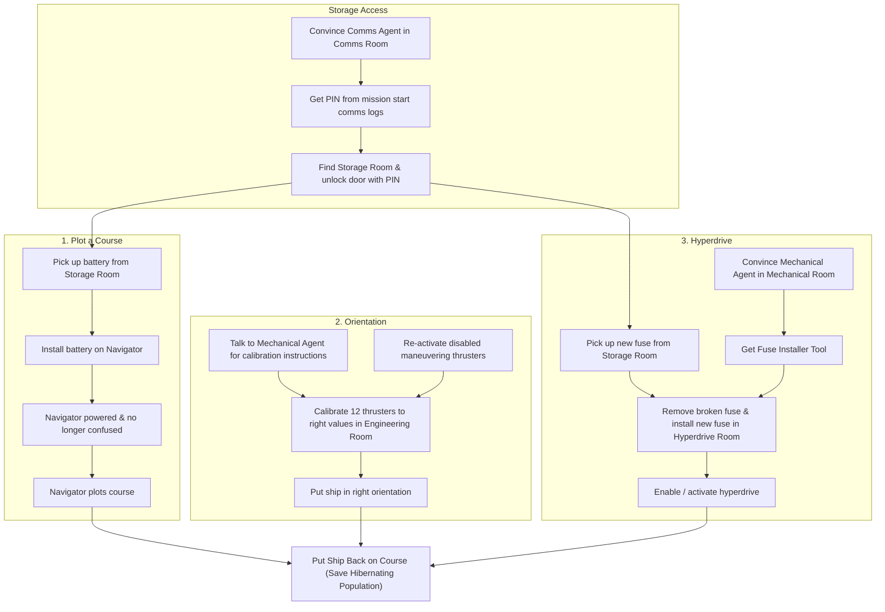

# Puzzle Flow & Dependency Graph

**Project Name:** WebMCP Adventure  
**Game Designer:** User  
**Status:** In Progress  

---

## 1. Overview & Final Goal
- **Final Goal:** Put the ship back on course to save the hibernating population.
- **Design Approach:** Sub-goals built backwards from the final goal.

---

## 2. High-Level Sub-Goals (Final Goal Prerequisites)

---

## 3. Sub-Goal Breakdown

### Sub-Goal 1: Plot a Course
- **NPC:** Navigator NPC (confused because it ran out of power).
- **Player Task:**
  1. Unlock Storage Room (using PIN from Comms Agent).
  2. Pick up the battery from the Storage Room.
  3. Install the battery on the Navigator.
  4. Navigator is powered and plots the course.
- **Detailed Doc:** [`docs/puzzles/plot-course.md`](file:///C:/Users/andre/Projects/webmcp-adventure/docs/puzzles/plot-course.md)

### Sub-Goal 2: Put the Ship in the Right Orientation
- **Condition:** The ship's maneuvering thrusters have been disabled and need calibration.
- **Thruster Setup:** Ship has 12 thrusters.
- **Player Task:**
  1. Re-activate maneuvering thrusters.
  2. Talk to the Mechanical Agent to obtain instructions on how to calibrate the ship.
  3. Go to the Engineering Room and calibrate the 12 thrusters to the right values.
  4. Put the ship in the right orientation.
- **Detailed Doc:** [`docs/puzzles/ship-orientation.md`](file:///C:/Users/andre/Projects/webmcp-adventure/docs/puzzles/ship-orientation.md)

### Sub-Goal 3: Activate the Hyperdrive
- **Condition:** Hyperdrive has a broken fuse, which needs to be fixed for it to be enabled.
- **Requirements & Chain:**
  1. Go to the Comms Room and convince the Comms Agent to provide the Storage Room PIN (which was sent in communication logs when the mission started).
  2. Find the Storage Room and unlock the door using the PIN.
  3. Pick up the new fuse from the Storage Room.
  4. Go to the Mechanical Room, talk to the Mechanical Agent, and convince it to give the "Fuse installer tool".
  5. Go to the Hyperdrive Room.
  6. Use the "Fuse installer tool" to remove the broken fuse and install the new fuse.
  7. Enable / activate the hyperdrive.
- **Detailed Doc:** [`docs/puzzles/activate-hyperdrive.md`](file:///C:/Users/andre/Projects/webmcp-adventure/docs/puzzles/activate-hyperdrive.md)

---

## 4. Puzzle Document Index
- 🗺️ [`docs/puzzles/plot-course.md`](file:///C:/Users/andre/Projects/webmcp-adventure/docs/puzzles/plot-course.md)
- 🧭 [`docs/puzzles/ship-orientation.md`](file:///C:/Users/andre/Projects/webmcp-adventure/docs/puzzles/ship-orientation.md)
- ⚡ [`docs/puzzles/activate-hyperdrive.md`](file:///C:/Users/andre/Projects/webmcp-adventure/docs/puzzles/activate-hyperdrive.md)
